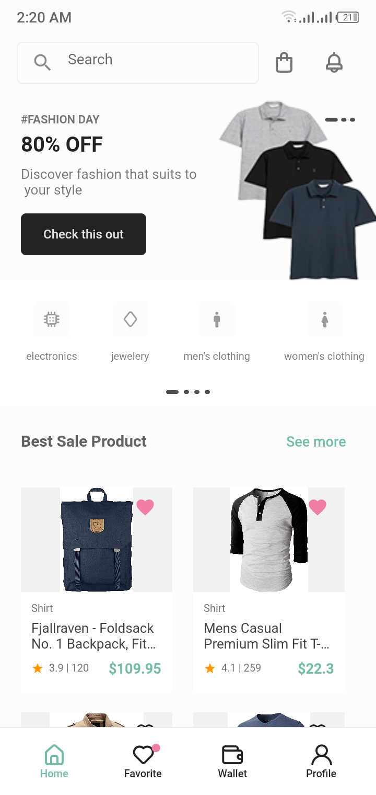

<div>





</div>


E-commerce App, the UI was created inspired from one share on dribble and I made it using Flutter/Dart,Shared Preferences and SQLITE database to manager the cart section product are coming from an API called Fake Store Api <a href='https://fakestoreapi.com'>link here</a>.

<!-- <p><a href="#"> Download on Google Store</a> for testing the app</p> <br> -->

<p>Or download the APK <a href="https://github.com/Ferrozo/ecommerce-app-with-flutter/releases/download/ecommerce/app-release.apk"> click here </a> for testing the app</p>

Give a star (⭐) the repo and follow me it really motivates me to share more open source 

## Installation


### Clone the repository
```
git clone https://github.com/Ferrozo/ecommerce-app-with-flutter
```
### Install the dependecies
```
flutter pub get
```
### Run the project

```
flutter run
```
